# M07_UF4
## View Templates 

* parte_1:

```java
    Renderizacion Estudiantes parte 1:
```
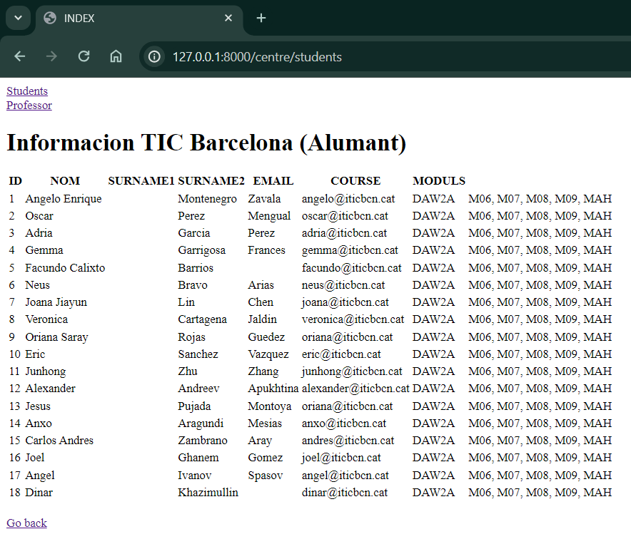
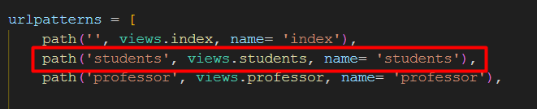


```java
    Renderizacion Profesores parte 1:
```

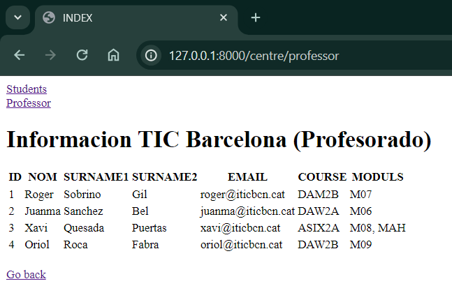
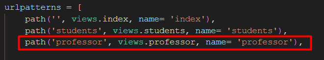


* parte_2:

<video width="320" height="240" controls>
  <source src="./img/ejecucionParte2.mp4" type="video/mp4">
</video>


[enlace_video_por_si_no_funciona_](https://drive.google.com/file/d/1gonG844Nb09yqamL8pfdfiT97wvPjzZz/view?usp=sharing)


# MODEL (PRACTICA 2)

se usa el comando par
```java
  python manage.py makemigrations
```
para preparar la migracion como se ve a continuacion:
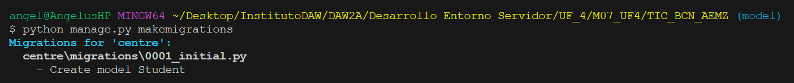

y para realizar la migracion a plenitud se ejecuta el comando:
```java
  python manage.py migrate
```
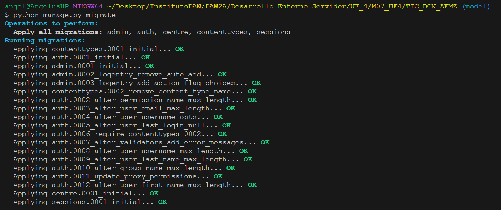


* En el sigueinte enlace al video se podra observar como se generan las migraciones en una base de datos que se encuentra vacia:

[video_migracion](https://drive.google.com/file/d/1s32ln-H2QW4rcMpI7q6KeZbPbzFE1wUO/view?usp=sharing)


# FORM (PRACTICA 3)

Evidencia CON uso de ('as_p'):
```java
<form action="" method="POST">
    
    {{ form.as_p }}
    <input type="submit">
</form>

```
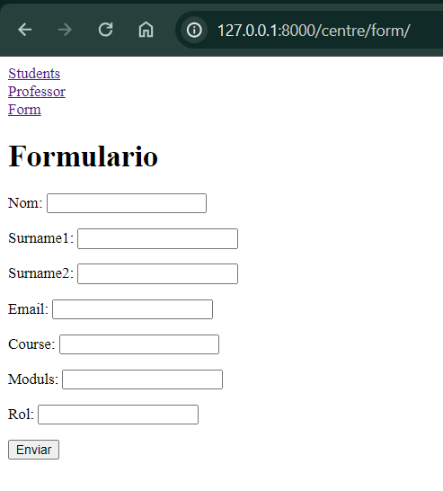

Evidencia SIN uso de ('as_p'):
```java
<form action="" method="POST">
    
    {{ form }}
    <input type="submit">
</form>

```
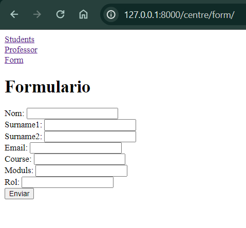

# CRUD (PRACTICA 4)

[video_demostracion_CRUD](https://drive.google.com/file/d/1v_oeY5NRXb4MLCmcvxRBdW0e197lyhX4/view?usp=sharing)

Evidencias(Estudiante):

* Create Student:

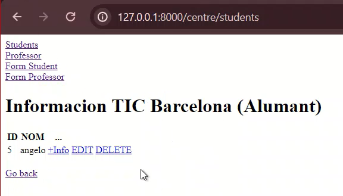

* Update Student:

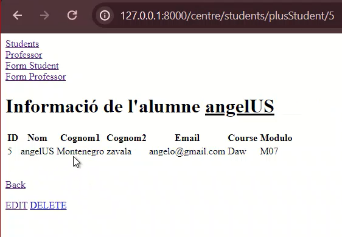

* Delete Student:

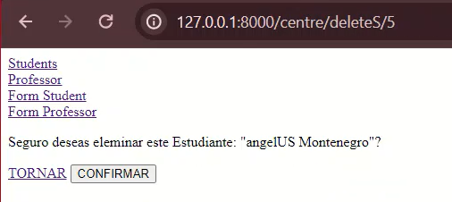

* Read despues del Delete Student:

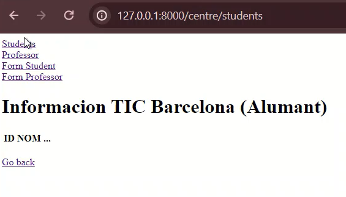


Evidencias(Professor):

* Create Professor:

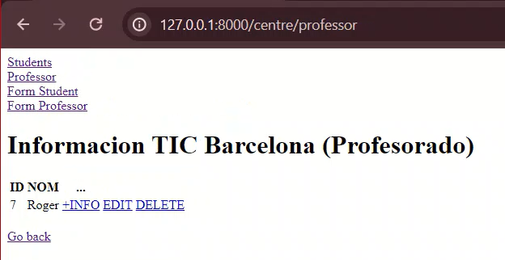

* Update Professor:

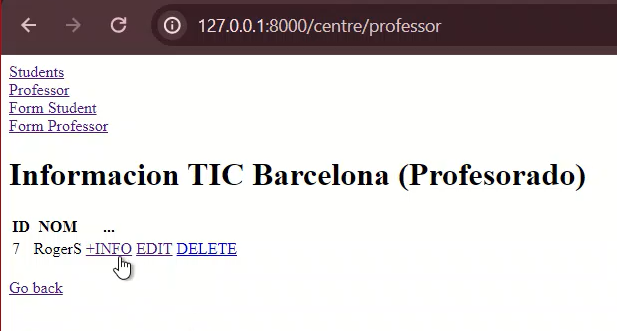

* Delete Professor:

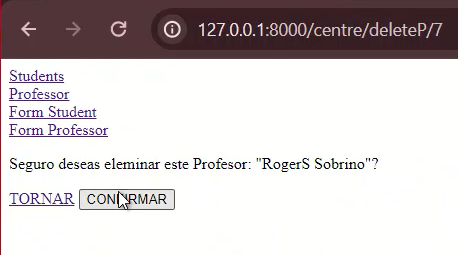

* Read despues del Delete Professor:

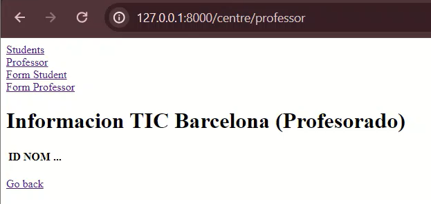